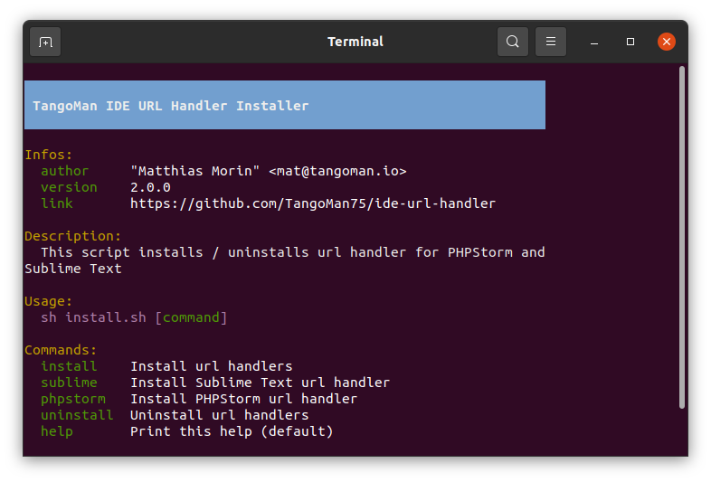

[](https://github.com/TangoMan75/ide-url-handler/releases)
[]((https://github.com/TangoMan75/ide-url-handler/blob/master/LICENSE))
[](https://github.com/TangoMan75/ide-url-handler/stargazers)
[](https://github.com/TangoMan75/ide-url-handler/actions/workflows/bash_unit.yml)
[](https://github.com/TangoMan75/ide-url-handler/actions/workflows/shellcheck.yml)


IDE URL Handler
===============

This package installs launchers to open files in **Atom**, **Emacs**, **Nano**, **PhpStorm**, **Pycharm**, **Sublime Text**, **Vim**, **Visual Studio Code** and **WebStorm** at the defined line number, the associated desktop file conforms to the _Desktop Entry Specification_ for use in _Gnome_ and _KDE desktop_ environments.



⏳ TL;DR
--------

Execute one of the following command in your terminal to install:
```sh
sudo sh -c "`wget -q https://raw.githubusercontent.com/TangoMan75/ide-url-handler/master/install.sh -O -` install"
```
or if you have `curl` installed:
```sh
sudo sh -c "`curl -fsSL https://raw.githubusercontent.com/TangoMan75/ide-url-handler/master/install.sh` install"
```

🎯 Features
-----------

It can be used to open files at the specified line from within the browser by placing a link of the following kind in the markup:

```php
<?php
$file = "/path/to/filename.php";
$line = 35;
print "<a href='phpstorm://open?url=file://$file&line=$line'>Open with PhpStorm</a>";
// Alternate Syntax to match PhpStorm 8 for the Macintosh
print "<a href='phpstorm://open?file=$file&line=$line'>Open with PhpStorm</a>";
?>
```

How to test from the command line :

```bash
$ xdg-open "atom://open?url=file:///etc/os-release&line=3"
$ xdg-open "code://open?url=file:///etc/os-release&line=3"
$ xdg-open "emacs://open?url=file:///etc/os-release&line=3"
$ xdg-open "nano://open?url=file:///etc/os-release&line=3"
$ xdg-open "phpstorm://open?url=file:///etc/os-release&line=3"
$ xdg-open "pycharm-community://open?url=file:///etc/os-release&line=3"
$ xdg-open "pycharm://open?url=file:///etc/os-release&line=3"
$ xdg-open "subl://open?url=file:///etc/os-release&line=3"
$ xdg-open "vim://open?url=file:///etc/os-release&line=3"
$ xdg-open "webstorm://open?url=file:///etc/os-release&line=3"
```

or

```bash
$ atom-url-handler "atom://open?url=file:///etc/os-release&line=3"
$ code-url-handler "code://open?url=file:///etc/os-release&line=3"
$ emacs-url-handler "emacs://open?url=file:///etc/os-release&line=3"
$ nano-url-handler "nano://open?url=file:///etc/os-release&line=3"
$ phpstorm-url-handler "phpstorm://open?url=file:///etc/os-release&line=3"
$ pycharm-community-url-handler "pycharm-community://open?url=file:///etc/os-release&line=3"
$ pycharm-url-handler "pycharm://open?url=file:///etc/os-release&line=3"
$ subl-url-handler "subl://open?url=file:///etc/os-release&line=3"
$ vim-url-handler "vim://open?url=file:///etc/os-release&line=3"
$ webstorm-url-handler "webstorm://open?url=file:///etc/os-release&line=3"
```

This alternative syntax matches the format used by PhpStorm 8 for the Macintosh for cross-platform compatibility.

```bash
$ atom-url-handler "atom://open?file:///etc/os-release&line=3"
$ code-url-handler "code://open?file:///etc/os-release&line=3"
$ emacs-url-handler "emacs://open?file:///etc/os-release&line=3"
$ nano-url-handler "nano://open?file:///etc/os-release&line=3"
$ phpstorm-url-handler "phpstorm://open?file:///etc/os-release&line=3"
$ pycharm-url-handler "pycharm://open?file:///etc/os-release&line=3"
$ pycharm-community-url-handler "pycharm-community://open?file:///etc/os-release&line=3"
$ subl-url-handler "subl://open?file:///etc/os-release&line=3"
$ vim-url-handler "vim://open?file:///etc/os-release&line=3"
$ webstorm-url-handler "webstorm://open?file:///etc/os-release&line=3"
```

🚀 Installation
---------------

### ⚡ Simply enter following command in your terminal

```bash
$ sudo sh install.sh install
```

🔥 Usage
--------

Run `sh install.sh` to print help

```bash
$ sh install.sh
```

Available commands are: `install` `uninstall` `install_atom` `install_code` `install_emacs` `install_nano` `install_phpstorm` `install_pycharm_community` `install_pycharm` `install_subl` `install_vim` and `help`

🤖 Commands
-----------

### ⚡ Install all URL Handlers
```bash
$ sudo sh install.sh install
```

### ⚡ Uninstall all URL Handlers
```bash
$ sudo sh install.sh uninstall
```

### ⚡ Install Atom URL Handler
```bash
$ sudo sh install.sh install_atom
```

### ⚡ Install Visual Studio Code URL Handler
```bash
$ sudo sh install.sh install_code
```

### ⚡ Install Emacs URL Handler
```bash
$ sudo sh install.sh install_emacs
```

### ⚡ Install Nano URL Handler
```bash
$ sudo sh install.sh install_nano
```

### ⚡ Install PHPStorm URL Handler
```bash
$ sudo sh install.sh install_phpstorm
```

### ⚡ Install Pycharm URL Handler
```bash
$ sudo sh install.sh install_pycharm
```

### ⚡ Install Pycharm Community URL Handler
```bash
$ sudo sh install.sh install_pycharm_community
```

### ⚡ Install Sublime Text URL Handler
```bash
$ sudo sh install.sh install_subl
```

### ⚡ Install Vim URL Handler
```bash
$ sudo sh install.sh install_vim
```

### ⚡ Print this help (default)
```bash
$ sh install.sh help
```

📑 Sources
----------

- [https://developer.happyr.com/open-files-in-phpstorm-from-you-symfony-application](https://developer.happyr.com/open-files-in-phpstorm-from-you-symfony-application)
- [https://github.com/sanduhrs/phpstorm-url-handler](https://github.com/sanduhrs/phpstorm-url-handler)
- [https://symfony.com/doc/current/reference/configuration/framework.html#ide](https://symfony.com/doc/current/reference/configuration/framework.html#ide)
- [https://stackoverflow.com/questions/14676981/sublime-text-url-handler-for-ubuntu](https://stackoverflow.com/questions/14676981/sublime-text-url-handler-for-ubuntu)

💻 Dependencies
---------------

**IDE URL Handler** requires the following dependencies:

- cat
- awk
- sed
- Docker (optional)
- Shellcheck (optional)

📑 IDEs
-------

Here's a list of pages where you can download popular IDEs for your system :

- [Download Atom](https://atom.io/)
- [Download Emacs](https://www.gnu.org/software/emacs/)
- [Download Nano](https://www.nano-editor.org/download.php)
- [Download PhpStorm](https://www.jetbrains.com/phpstorm/download/)
- [Download Pycharm](https://www.jetbrains.com/pycharm/download/)
- [Download Sublime Text](https://www.sublimetext.com/3)
- [Download Vim](https://www.vim.org/download.php)
- [Download Visual Studio Code](https://code.visualstudio.com/download)
- [Download WebStorm](https://www.jetbrains.com/webstorm/download/)

🤝 Contributing
---------------

Thank you for your interest in contributing to **IDE URL Handler**.

Please review the [code of conduct](./CODE_OF_CONDUCT.md) and [contribution guidelines](./CONTRIBUTING.md) before starting to work on any features.

If you want to open an issue, please check first if it was not [reported already](https://github.com/TangoMan75/ide-url-handler/issues) before creating a new one.

📜 License
----------

Copyrights (c) 2025 &quot;Matthias Morin&quot; &lt;mat@tangoman.io&gt;

Copyrights (c) 2017 &quot;Stefan Auditor&quot; &lt;stefan.auditor@erdfisch.de&gt;

[](LICENSE)
Distributed under the GPL3 license.

If you like **IDE URL Handler** please star, follow or tweet about it:

[](https://github.com/TangoMan75/ide-url-handler/stargazers)
[](https://github.com/TangoMan75)
[](https://twitter.com/intent/tweet?text=Wow:&url=https%3A%2F%2Fgithub.com%2FTangoMan75%2Fide-url-handler)

... And check my other cool projects.

🙏 Acknowledgements
-------------------

- This script is a fork of **Stefan Auditor** [phpstorm-url-handler](https://github.com/sanduhrs/phpstorm-url-handler)
- [bash_unit](https://github.com/pgrange/bash_unit): bash unit testing enterprise edition framework (used for CI/CD)
- [shellcheck](https://github.com/koalaman/shellcheck): a static analysis tool for shell scripts (used for CI/CD)

👋 Let's Build Your Next Project Together !
-------------------------------------------

Looking for an experienced Full-Stack Partner ?

Clean code. Clear communication.

From first sketch to final launch, I've got your back.

[](https://tangoman.io)
