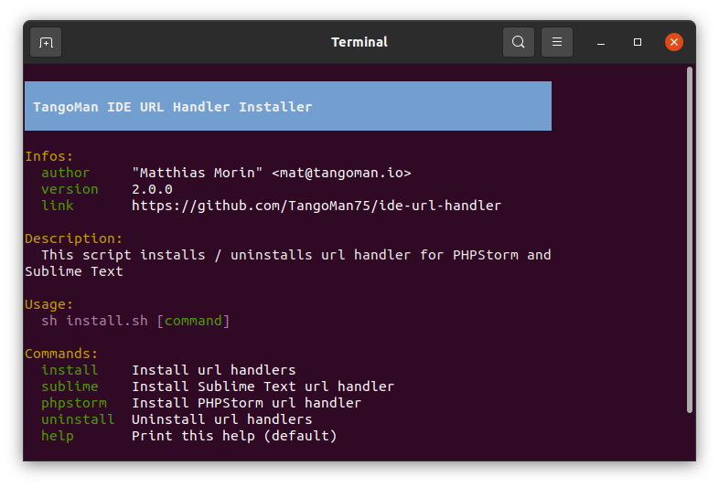

[](https://github.com/TangoMan75/ide-url-handler/releases)
[]((https://github.com/TangoMan75/ide-url-handler/blob/master/LICENSE))
[](https://github.com/TangoMan75/ide-url-handler/stargazers)
[](https://github.com/TangoMan75/ide-url-handler/actions/workflows/bash_unit.yml)
[](https://github.com/TangoMan75/ide-url-handler/actions/workflows/shellcheck.yml)


IDE URL Handler
===============

This package contains launchers to open files in **PhpStorm** and **Sublime Text** at the defined line number and an associated desktop file that conforms to the Desktop Entry Specification for use in Gnome and KDE desktop environments.



🎯 Features
-----------

It can be used to open files at the specified line from within the browser by placing a link of the following kind in the markup:

```php
<?php
$file = "/path/to/filename.php";
$line = 35;
print "<a href='phpstorm://open?url=file://$file&line=$line'>Open with PhpStorm</a>";
// Alternate Syntax to match PhpStorm 8 for the Macintosh
print "<a href='phpstorm://open?file=$file&line=$line'>Open with PhpStorm</a>";
?>
```

From the command line:

```bash
FILE="/path/to/filename.php"
LINE=35
./phpstorm-url-handler "phpstorm://open?url=file://${FILE}&line=${LINE}"
```

This alternative syntax matches the format used by PhpStorm 8 for the Macintosh for cross-platform compatibility.

```bash
FILE="/path/to/filename.php"
LINE=35
./phpstorm-url-handler "phpstorm://open?file=${FILE}&line=${LINE}"
```

This script is used in the ARCH linux package to be found at phpstorm-url-handler https://aur.archlinux.org/packages/phpstorm-url-handler/

How to test:

```bash
$ xdg-open txmt://open?url=file://${file}&line=${line}
```

🚀 Installation
---------------

### ⚡ Simply enter following command in your terminal

```bash
$ sudo sh install.sh install
```

🔥 Usage
--------

Run `sh install.sh` to print help

```bash
$ sh install.sh
```

Available commands are: `install sublime phpstorm uninstall help`

🤖 Commands
-----------

### ⚡ Install url handlers
```bash
$ sudo sh install.sh install
```

### ⚡ Install Sublime Text url handler
```bash
$ sudo sh install.sh sublime
```

### ⚡ Install PHPStorm url handler
```bash
$ sudo sh install.sh phpstorm
```

### ⚡ Uninstall url handlers
```bash
$ sudo sh install.sh uninstall
```

### ⚡ Print this help (default)
```bash
$ sh install.sh help
```

📑 Sources
----------

- [https://developer.happyr.com/open-files-in-phpstorm-from-you-symfony-application](https://developer.happyr.com/open-files-in-phpstorm-from-you-symfony-application)
- [https://github.com/sanduhrs/phpstorm-url-handler](https://github.com/sanduhrs/phpstorm-url-handler)
- [https://symfony.com/doc/current/reference/configuration/framework.html#ide](https://symfony.com/doc/current/reference/configuration/framework.html#ide)
- [https://stackoverflow.com/questions/14676981/sublime-text-url-handler-for-ubuntu](https://stackoverflow.com/questions/14676981/sublime-text-url-handler-for-ubuntu)

💻 Dependencies
---------------

**IDE URL Handler** requires the following dependencies:

- Awk
- Sed
- bash_unit (optional)
- Docker (optional)
- Shell (ash supported) (optional)
- Shellcheck (optional)

🤝 Contributing
---------------

Thank you for your interest in contributing to **IDE URL Handler**.

Please review the [code of conduct](./CODE_OF_CONDUCT.md) and [contribution guidelines](./CONTRIBUTING.md) before starting to work on any features.

If you want to open an issue, please check first if it was not [reported already](https://github.com/TangoMan75/ide-url-handler/issues) before creating a new one.

📜 License
----------

Copyrights (c) 2021 &quot;Matthias Morin&quot; &lt;mat@tangoman.io&gt;
Copyrights (c) 2017 &quot;Stefan Auditor&quot; &lt;stefan.auditor@erdfisch.de&gt;

[](LICENSE)
Distributed under the GPL3 license.

If you like **IDE URL Handler** please star, follow or tweet about it:

[](https://github.com/TangoMan75/ide-url-handler/stargazers)
[](https://github.com/TangoMan75)
[](https://twitter.com/intent/tweet?text=Wow:&url=https%3A%2F%2Fgithub.com%2FTangoMan75%2Fide-url-handler)

... And check my other cool projects.

🙏 Acknowledgements
-------------------

- This script is a fork of **Stefan Auditor** [phpstorm-url-handler](https://github.com/sanduhrs/phpstorm-url-handler)
- [bash_unit](https://github.com/pgrange/bash_unit): bash unit testing enterprise edition framework (used for CI/CD)
- [shellcheck](https://github.com/koalaman/shellcheck): a static analysis tool for shell scripts (used for CI/CD)
